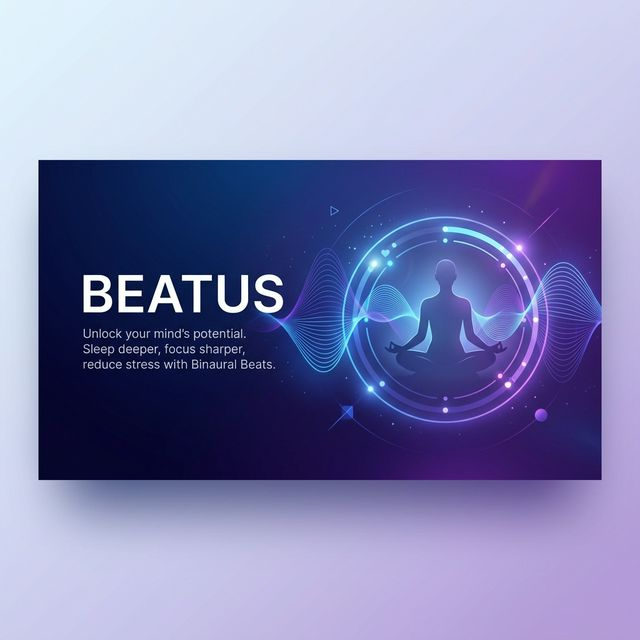

<div align="center">
  
  
  # ✨ Beatus
</div>

**Beatus** (Latin for *blessed*, *fortunate*, or *happy*) is a modern wellness and mindfulness application designed to enhance mental well-being through binaural beats and comprehensive health tracking. Built with Expo and React Native, Beatus bridges the gap between auditory therapy and fitness data.

---

## 🚀 Key Features

### 🎧 Binaural Beats Player
Experience custom-generated binaural beats tailored for focus, deep sleep, relaxation, and mindfulness. 
- **Real-time Frequency Control**: Seamless audio playback using `expo-audio`.
- **Session Logging**: Automatically tracks your mindfulness journey.

### ⌚ Google Fit Integration (Smartwatch Connectivity)
Sync your physiological data directly from your wearable devices.
- **Health Metrics**: Real-time tracking of Heart Rate, Steps, Sleep patterns, and Activity levels.
- **Secure Authentication**: Robust implementation using Supabase and Google OAuth.

### 📊 Health Dashboard & Analytics
Visualize your progress with beautiful, interactive visualizations.
- **Interactive Charts**: Powered by `react-native-gifted-charts`.
- **Historical Analysis**: Review your previous sessions and mood trends.

### 🎨 Modern UI/UX
- **Dynamic Theming**: Support for both Dark and Light modes.
- **Premium Aesthetics**: Glassmorphism, linear gradients, and smooth animations using `react-native-reanimated`.

---

## 🛠️ Tech Stack

- **Framework**: [Expo](https://expo.dev) / [React Native](https://reactnative.dev)
- **Language**: [TypeScript](https://www.typescriptlang.org/)
- **Backend**: [Supabase](https://supabase.com) (Auth, Database, Storage)
- **State Management**: [Zustand](https://github.com/pmndrs/zustand)
- **Routing**: [Expo Router](https://docs.expo.dev/router/introduction) (File-based routing)
- **Icons**: Hugeicons, Lucide React Native
- **Styling**: Expo Linear Gradient, React Native Reanimated

---

## 📦 Installation & Setup

### Prerequisites
- [Node.js](https://nodejs.org/) (LTS)
- npm or yarn
- [Expo Go](https://expo.dev/go) app on your mobile device (for testing)

### Step 1: Clone the Repository
```bash
git clone https://github.com/[your-username]/beatus.git
cd beatus
```

### Step 2: Install Dependencies
```bash
npm install
```

### Step 3: Environment Configuration
Create a `.env` file in the root directory and add your Supabase and Google API credentials:
```env
EXPO_PUBLIC_SUPABASE_URL=your_supabase_url
EXPO_PUBLIC_SUPABASE_ANON_KEY=your_supabase_anon_key
# Additional IDs for Google Sign-In
```

### Step 4: Start Developing
```bash
npx expo start
```
Scan the QR code with your Expo Go app or press `a` for Android Emulator / `i` for iOS Simulator.

---

## 🏗️ Project Structure

- `app/`: Expo Router file-based pages and layouts.
- `components/`: Reusable UI components.
- `context/`: React Context providers (Player, Auth).
- `hooks/`: Custom hooks for audio, theme, and health data.
- `lib/`: Configuration files (Supabase client, API client).
- `constants/`: Theme tokens, colors, and global constants.
- `assets/`: Lottie animations, images, and fonts.

---

## 🔐 Permissions
The application requires the following permissions for full functionality:
- **Health Data**: Access to Google Fit data types (Heart rate, steps, sleep).
- **Audio**: Record/Modify audio settings for the binaural beats playback.

---

## 📄 License
This project is licensed under the MIT License - see the [LICENSE](LICENSE) file for details.

---

*Developed by [Shyamkano](https://github.com/Shyamkano)*
