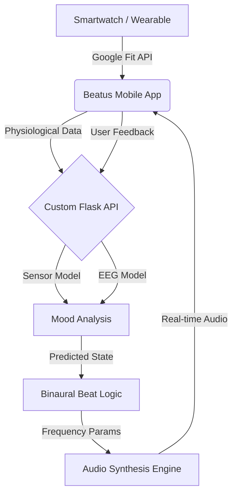

  
  
  # ✨ Beatus

**Beatus** (Latin for *blessed*, *fortunate*, or *happy*) is an advanced AI-driven wellness application that synchronizes your physiological state with personalized auditory therapy. It uses machine learning models to analyze smartwatch data and programmatically generate binaural beats tailored to your real-time mood.

---

## 🧠 The Technical Core

Beatus is not just a music player; it's a closed-loop health system powered by custom Machine Learning models:

### 🔬 EEG & Sensor Fusion Model
The system ingests high-fidelity data from your smartwatch via Google Fit (Heart Rate, Sleep Stages, Activity Intensity, etc.). 
- **Sensor Model**: Processes physiological signals to identify patterns in your daily wellness.
- **EEG Inference**: Incorporates simulated/modeled EEG data patterns to refine the understanding of your cognitive state.

### 🎭 Mood Prediction Engine
Our custom ML model analyzes the fused sensor data to suggest your current emotional and cognitive state (e.g., Stressed, Focused, Exhausted, or Calm).

### 🎼 Programmatic Binaural Generation
Unlike static audio files, Beatus communicates with a custom API to generate audio frequencies in real-time.
- **Dynamic Frequencies**: The app requests specific binaural offsets (Alpha, Beta, Theta, or Delta) that counteract your current state or enhance a desired one.
- **Closed-Loop Feedback**: As your health metrics improve during a session, the audio frequencies adapt to maintain the optimal mental state.

---

## 🏗️ Architecture

---

## 🚀 Key Features

- **🎧 Predictive Audio**: Binaural beats generated according to your predicted mood.
- **⌚ Smartwatch Sync**: Real-time tracking of HR, Steps, Sleep, and Activity via Google Fit.
- **📊 Interactive Analytics**: Visualize the correlation between your audio sessions and your health metrics.
- **🛡️ Secure & Private**: Encrypted data handling with Supabase and secure OAuth 2.0.

---

## 🛠️ Tech Stack

- **Frontend**: Expo, React Native, TypeScript, Expo Router
- **Backend**: Custom Flask API (ML Inference Engine)
- **Database/Auth**: Supabase
- **Health Data**: Google Fit SDK
- **Data Viz**: React Native Gifted Charts
- **Animations**: Lottie, Reanimated

---

## 📦 Installation & Setup

### Prerequisites
- Node.js (LTS), npm/yarn, Expo Go
- [ai-cognitive-api (Flask)](https://github.com/Shyamkano/ai-cognitive-api)

### 📚 API Documentation
The live API documentation for the backend can be found here:  
**[Interactive Swagger UI](https://shyamkano-ai-cognitive-api.hf.space/apidocs/)**

### Setup
1. **Clone & Install**: `npm install`
2. **Environment**: Set `EXPO_PUBLIC_SUPABASE_URL` and `EXPO_PUBLIC_SUPABASE_ANON_KEY` in `.env`.
3. **API Alignment**: Update the `API_URL` in `lib/apiClient.ts` to point to your Flask server.
4. **Run**: `npx expo start`

---

## 📄 License
MIT License. Developed by [Shyamkano](https://github.com/Shyamkano)
